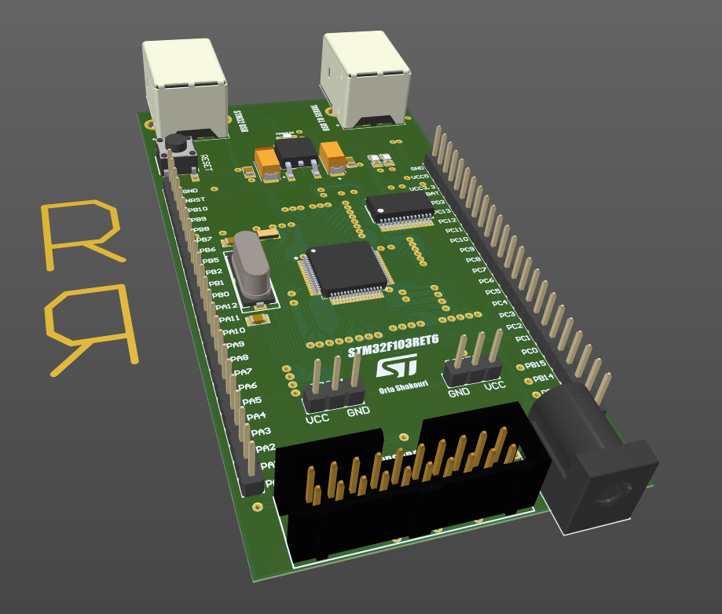
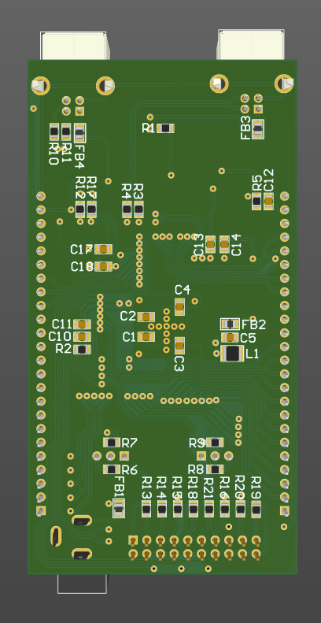
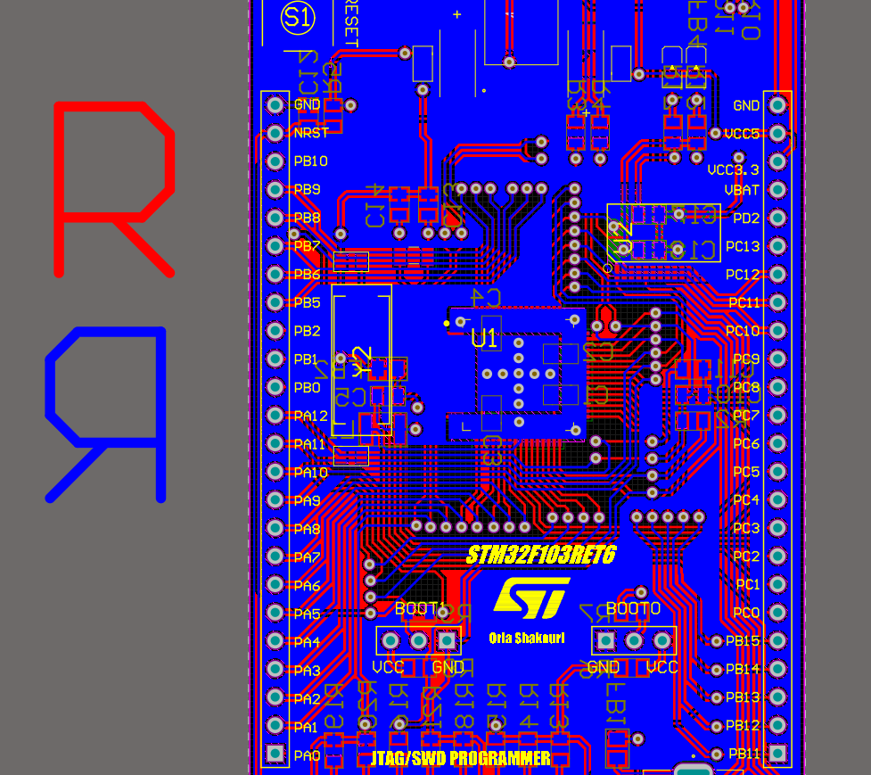

# STM32F103RET6-Breadboard-DevKit
## Overview
STM32F103RET6 Breadboard Dev Kit is one of my personal projects, which is a 2 layer board created for those who want to learn the easiest and most accessible family of STMicroelectronics microcontrollers. The STM32F103RET6 belongs to the F1 family of 32-bit ARM Cortex-M3 processors, which is an excellent starting point for learning embedded systems and ARM programming. This development board is designed with breadboard compatibility, featuring 51 multifunctional I/O pins, integrated USB-UART and SWD debug interfaces, and supports multiple communication protocols like I2C, SPI, UART, and CAN. It operates at up to 72 MHz and includes power management options, making it ideal for rapid prototyping and fundamental tests in embedded development.

## Hardware Features
- **Full GPIO Access**: All 51 STM32F103RET6 GPIO pins are routed to clearly labeled 2.54 mm (0.1") headers, compatible with standard solderless breadboards for easy prototyping.
- **USB-UART Bridge**: Onboard FT232RL for reliable serial communication and debugging (USB Type-B connector) 
- **Debug Interface**: 2x10 box header for JTAG/SWD programming and debugging with ST-Link or OpenOCD or J-Link
- **Precision Oscillators**: 32.768 kHz RTC crystal + 12 MHz HSE crystal for accurate timing and 72 MHz system clock 
- **Native USB Support**: USB 2.0 Type-B connector wired directly to STM32F103RET6 high-speed USB peripheral 
- **Flexible Power**: 5V DC barrel jack input with onboard 3.3V low-noise linear regulator (LDO) for clean MCU supply
- **Analog and Digital Power Separation**: Dedicated analog and digital power rails designed to minimize noise coupling and improve ADC performance for sensitive measurement applications.
- **Boot Configuration**: Dedicated BOOT0/BOOT1 header pins for easy bootloader selection and firmware updates 
- **Reset Control**: Onboard push-button for MCU hardware reset with debouncing

This power design approach ensures low noise operation and stable voltage rails, critical for precision analog and digital embedded applications. The separated analog and digital power supplies help reduce signal interference and improve overall system reliability.

## Images 
* STM32F103RET6 Devkit Altium Designer 3D images :

* STM32F103RET6 Devkit Real Board :

   
## Validation & Testing
Fully Built and Production-Tested: This board has been physically manufactured, assembled, and rigorously tested in the real world across all major subsystems and peripherals.
* Verified full functionality of GPIO, UART (FT232RL), USB 2.0, JTAG/SWD debug, power regulation, boot modes, and reset circuitry
* Comprehensive protocol validation: I2C, SPI, CAN interfaces confirmed operational at rated speeds
* Power integrity testing: Low-noise 3.3V LDO stable under load; analog/digital rail separation eliminates crosstalk and ensures clean ADC performance
* No hardware defects, signal integrity issues, or weaknesses identified after extended lab testing and breadboard integration trials
  
The design is production-ready for education, prototyping, and small-batch manufacturing with reliable performance matching commercial STM32 dev boards.
